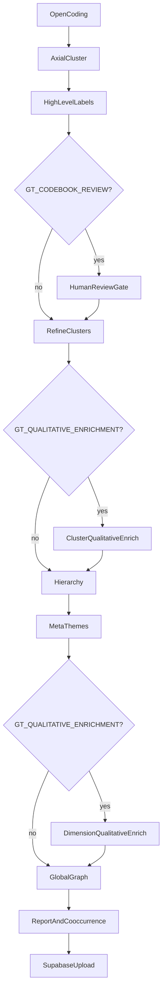

# Grounded-theory pipeline

This repository implements an **agentic grounded-theory (GT) workflow**: unstructured text is taken through open coding, axial clustering, hierarchy construction, meta-theme grouping, and assembly of a global thematic graph, with optional downstream reporting and co-occurrence analysis. The LangGraph-based runner lives under `agents/`; prompt “skills” live in `agents/skills/`. Figures below summarize the **end-to-end pipeline** and **validation** of theme recovery against a reference coding.

---

## Developer quickstart

### Before pushing / opening a PR

Run these from the repo root:

- `make fix` (auto-fix lint + format)
- `make check` (lint check + format check + tests)

Equivalent direct commands:

- `ruff check --fix agents/core tests`
- `ruff format agents/core tests`
- `ruff check agents/core tests`
- `ruff format --check agents/core tests`
- `pytest`

### Open-coding validator toggle

Validator usage is controlled by a single boolean in `agents/core/state.py`:

- `USE_OPEN_CODES_VALIDATOR = True` -> run `validate_open_codes` and retry on FAIL
- `USE_OPEN_CODES_VALIDATOR = False` -> skip validator and accept first open-coding pass

`agents/cli.py` logs this mode at runtime as `OPEN_CODING_VALIDATOR`, so it appears in terminal/Slurm output.

### High-level cluster-label strategy

The high-level label generation strategy is configured in `agents/core/tools.py` and can be changed via env vars:

- `GT_HIGH_LEVEL_STRATEGY` (`nsampling` default, or fallback first-30 strategy)
- `GT_HL_N_SAMPLES` (default `5`)
- `GT_HL_SAMPLE_SIZE` (default `15`)

The active strategy is logged as `HIGH_LEVEL_STRATEGY` during runs.

---

## Pipeline overview

The diagram is a single-page map of how data moves through tools and artifacts (codes → clusters → hierarchy → meta-themes → global graph). Use it when onboarding to the repo or when tracing which stages feed which intermediate JSON under `agents/outputs/data/`.



---

## Local human-in-the-loop

With `GT_CODEBOOK_REVIEW=1`, the pipeline pauses after axial clustering and high-level labels. It exports a draft codebook to `viewer-data/`, then waits for a researcher to review it in the **Graph Builder viewer** before continuing to hierarchy and downstream stages.

```bash
# After a run exports viewer-data/, or on HPC in a second terminal while the job waits:
python tools/viewer_launcher.py --data-dir ./viewer-data
```

In the viewer, use **Codebook review** to inspect clusters, edit labels, and **Approve & export**. The launcher auto-saves `codebook_v2.json` back into `viewer-data/`; the pipeline picks it up and resumes. When the run finishes, **Library** shows the theme graph and research report.

No Supabase or npm is required for this flow. See [tools/howToRun.md](tools/howToRun.md) for file layout and troubleshooting.

---

## Validation: theme recovery

We compare predicted theme assignments to a reference codebook on the evaluation split. The overview figure summarizes the setup and headline numbers; the plots below show agreement patterns and scores in more detail.


### Results

**Confusion matrix** — predicted vs. reference labels; the diagonal is correct assignments.


**Overall scores** — aggregate metrics in one view.


**Per-class scores** — metric broken down by theme.


---